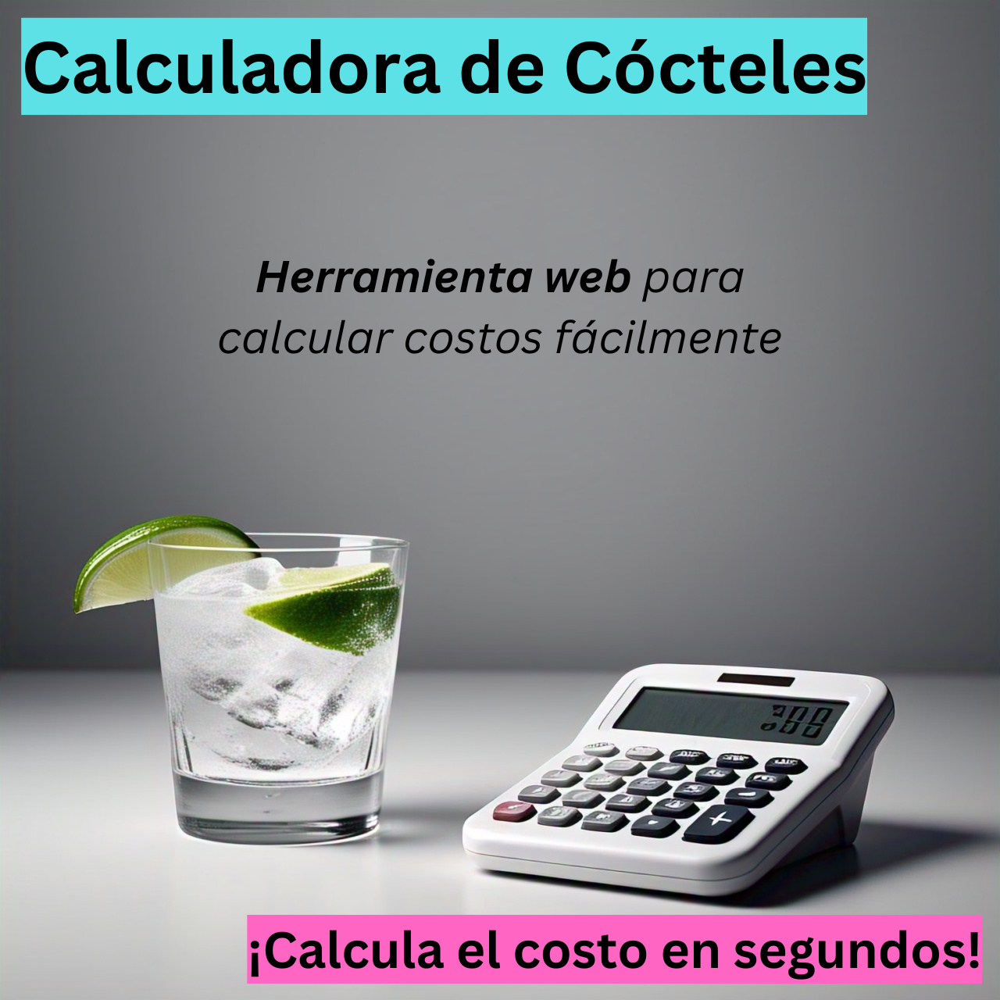

# COCKTAIL COST CALCULATOR | Calculadora Universal de Costos de Cocteles

The easier and fast calculator for bartender man

## Technologies

1. reactJS
2. tailwindcss

## Preview App v1

**Requirements**

- node 18 to 20
- npm

**for development**

    cd app-frontend
    npm run dev

**For production**

    cd app-frontend
    npm run build
    cd ..
    cp -r ./app-frontend/dist/* ./docs/.